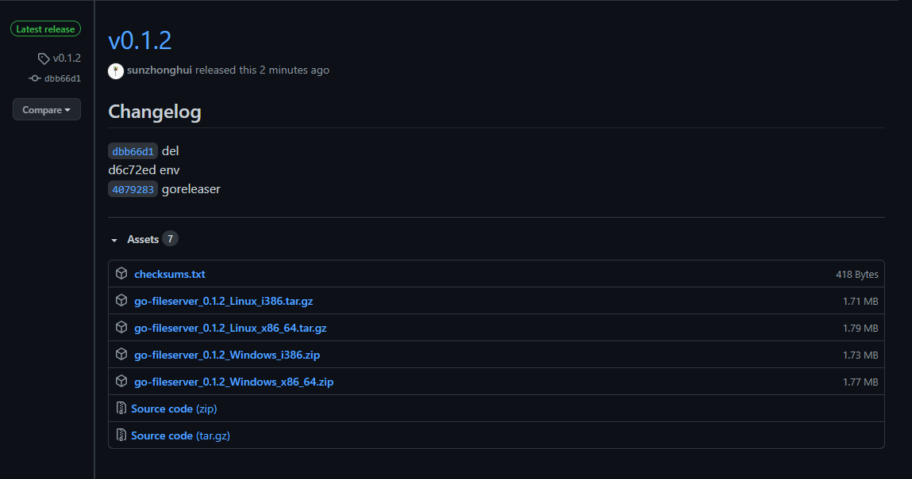

### 前言

> Golang 使用 GoReleaser 多平台打包发布

开发环境：

- Windows 10
- GoLand 2020.2
- Go 1.15.1
- GoReleaser 0.149.0

### 安装GoReleaser环境

**脚本一键安装**

```
curl -sfL https://install.goreleaser.com/github.com/goreleaser/goreleaser.sh | sh
```

**安装包安装**

下载地址:
https://github.com/goreleaser/goreleaser/releases

```
goreleaser --version
goreleaser version 0.149.0
commit: a69839327f0015ebb0990d41a6fa73b880de2873
built at: 2020-12-01T00:53:47Z
built by: goreleaser
```

### 生成配置文件

**在项目目录下执行**

```
#在目录下生成 .goreleaser.yml 配置文件
goreleaser init
```

### 测试打包

**只在本地打包，不上传到git服务器**

```
#删除本地打包文件夹并打包
goreleaser --snapshot --skip-publish --rm-dist
```

### 打包发布到GitHub/GitLab

**创建好令牌，设置环境变量**

```
export GITHUB_TOKEN="YOUR_GH_TOKEN"
# or
export GITLAB_TOKEN="YOUR_GL_TOKEN"
 
git tag -a v0.0.1 -m "打包v0.1.2"
 
git push origin v0.1.2
 
goreleaser release
```

在github上就可以看到打包成功的tag


[](http://f.idmiss.com/image/idmiss/701/github-tag.png)


### 配置文件实例

**.goreleaser.yml**
打包 windows 跟 Linux

```
# This is an example goreleaser.yaml file with some sane defaults.
# Make sure to check the documentation at http://goreleaser.com
project_name: go-fileserver
uploads:
  - name: production
    target: http://some.server/some/path/example-repo-local/{{ .ProjectName }}/{{ .Version }}/
    username: goreleaser
before:
  hooks:
  # You may remove this if you don't use go modules.
  #- go mod download
  # you may remove this if you don't need go generate
  #- go generate ./...
builds:
  - env:
      - CGO_ENABLED=0
    goos:
      - linux
      - windows
archives:
  - replacements:
      linux: Linux
      windows: Windows
      386: i386
      amd64: x86_64
    format_overrides:
      - goos: windows
        format: zip
    files:
      - .env
checksum:
  name_template: 'checksums.txt'
snapshot:
  name_template: "{{ .Tag }}-snapshot"
changelog:
  sort: asc
  filters:
    exclude:
      - '^docs:'
      - '^test:'
```

参考文档：https://goreleaser.com/
原文：http://www.idmiss.com/669