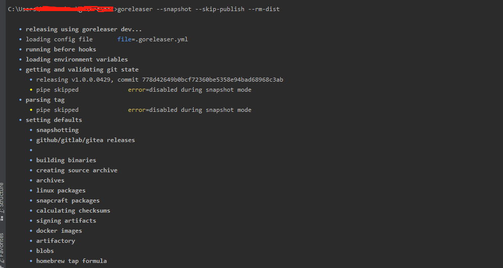

# Golang 编译打包-构建集成

golang编译方式一般分为两种，一种是源码编译，另外一个是交叉编译

## 1.源码编译

这种方式需要在机器上安装相应的go sdk，可以参考环境部署相关的文章，这里不再叙述；我们只需要把项目代码copy到相应的机器上，然后再项目目录中，执行命令：go build ./main.go -o outdir，编译速度非常快，接着在outdir文件中即可看到编译后的二进制文件或exe文件


## 2.交叉编译

在编译到linux等其他目标平台前，需要在机器上安装MingGW c++编译环境。更多信息请参考官网文档：https://github.com/golang/go/wiki#release-specific-information

```
GOOS：目标平台的操作系统（darwin、freebsd、linux、windows） 
GOARCH：目标平台的体系架构（386、amd64、arm） 
交叉编译不支持 CGO 所以要禁用它，如果要使用CGO，需要源码编译构建。
```

The valid combinations of GOOS and GOARCH are:

| GOOS      | GOARCH   |
| --------- | -------- |
| aix       | ppc64    |
| android   | 386      |
| android   | amd64    |
| android   | arm      |
| android   | arm64    |
| darwin    | 386      |
| darwin    | amd64    |
| darwin    | arm      |
| darwin    | arm64    |
| dragonfly | amd64    |
| freebsd   | 386      |
| freebsd   | amd64    |
| freebsd   | arm      |
| illumos   | amd64    |
| js        | wasm     |
| linux     | 386      |
| linux     | amd64    |
| linux     | arm      |
| linux     | arm64    |
| linux     | ppc64    |
| linux     | ppc64le  |
| linux     | mips     |
| linux     | mipsle   |
| linux     | mips64   |
| linux     | mips64le |
| linux     | s390x    |
| netbsd    | 386      |
| netbsd    | amd64    |
| netbsd    | arm      |
| openbsd   | 386      |
| openbsd   | amd64    |
| openbsd   | arm      |
| openbsd   | arm64    |
| plan9     | 386      |
| plan9     | amd64    |
| plan9     | arm      |
| solaris   | amd64    |
| windows   | 386      |
| windows   | amd64    |

###  2.1 Windows主机编译Linux,MAC客户端

Windows主机编译Windows客户端

```
SET CGO_ENABLED=0
SET GOOS=windows
SET GOARCH=amd64
go build -o abc-demo-windows.exe main.go
```

Windows主机编译LINUX客户端

```
SET CGO_ENABLED=0
SET GOOS=linux
SET GOARCH=amd64
go build -o abc-demo-linux main.go
```

Windows主机编译MAC客户端

```
SET CGO_ENABLED=0
SET GOOS=darwin
SET GOARCH=amd64
go build -o abc-demo-mac main.go
```

### 2.2 Linux主机编译Widows,MAC客户端

```
CGO_ENABLED=0 GOOS=linux GOARCH=amd64 go build -o abc-demo-linux main.go
CGO_ENABLED=0 GOOS=darwin GOARCH=amd64 go build -o adc-demo-mac main.go
CGO_ENABLED=0 GOOS=windows GOARCH=amd64 go build -o abc-demo-windows.exe main.go
```

### 2.3 MAC主机编译Widows,linux客户端

```
CGO_ENABLED=0 GOOS=linux GOARCH=amd64 go build -o abc-demo-linux main.go
CGO_ENABLED=0 GOOS=darwin GOARCH=amd64 go build -o abc-demo-mac main.go
CGO_ENABLED=0 GOOS=windows GOARCH=amd64 go build -o abc-demo-windows.exe main.go
```

这里以windows下编译linux amd64示例，直接编写一个bat脚本，然后双击执行

编译比源码编译少慢了点，结果如下：


可以看到成功的编译了一个二进制文件hai，该文件可以直接在目标平台上以 ./hai &的方式运行起来。

## 3.多平台一键打包

### 下面就来介绍一下打包神器 GoReleaser


goreleaser是一个自动化打包工具，解放双手，省去脚本编写，同时还支持对接CI/CD。
下面我们通过一个简单的例子来说明怎么使用 GoReleaser

### 3.1. 工具安装


下载安装 [goreleaser](https://links.jianshu.com/go?to=https%3A%2F%2Fgithub.com%2Fgoreleaser%2Fgoreleaser%2Freleases) （go get -u -v [github.com/goreleaser/goreleaser](https://github.com/goreleaser/goreleaser.git)）
安装后执行 goreleaser -v 命令判断是否安装成功


### 3.2. 创建demo工程


这次以hai项目为例，也可以自己新建一个hello world项目尝试

### 3.3. 初始化配置


然后在该项目根目录执行 goreleaser init ，将会生成一个.goreleaser.yml配置文件

打开文件


### 3.4. 修改配置

默认配置文件需要稍作修改以满足我们的需求
我们的demo项目没有使用go generate，需要把 - go generate ./... 注释掉
添加我们需要的目标操作系统类型及架构
经过修改后的配置文件如下

### 3.5. 打包

然后执行打包命令来验证是否打包成功
goreleaser --snapshot --skip-publish --rm-dist



可以看到编译的情况及速度


打包成功后将会在项目根目录/dist下生成各种不同平台的可执行文件

### 3.6.配置文件说明

id：打包后目录前缀
goos：目标系统
goarch：目标CPU架构
snapshot.name_template：生成压缩包名称前缀
详细配置请参考官网
build配置： [编译配置](https://links.jianshu.com/go?to=https%3A%2F%2Fgoreleaser.com%2Fbuild%2F)
archives配置：[打包配置](https://links.jianshu.com/go?to=https%3A%2F%2Fgoreleaser.com%2Farchive%2F)
goos和goarch是乘积关系，至于为什么没有生成windows_arm64这样的可执行程序 是因为windows不能再arm上跑。
golang官网也列出了goos和goarch的兼容表。