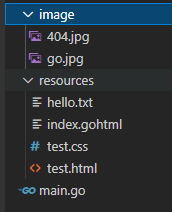

简介
==

`go:embed` 是 `go` 1.16版本添加的新特性，可以在 `go` 生成的应用程序中嵌入静态文件（文件，文件夹）。部署的时候，直接扔一个[二进制](https://so.csdn.net/so/search?q=%E4%BA%8C%E8%BF%9B%E5%88%B6&spm=1001.2101.3001.7020)文件即可，不用再包含一些静态文件，考虑文件相对位置，因为它们已经被打包到生成的应用程序中了。

导入 `embed` 的 `go` 源文件可以使用 `//go:embed` 指令在编译时从包目录或子目录中将读取的内容转换成 `string`, `[]byte`, 或者 `embed.FS` 类型的变量。

基本用法
====

目录层级：  

下面用到的 `hello.txt` 的内容：

    hello world!

### 转换成 `string`

    import (
    	_ "embed"
    	"fmt"
    )
    
    //go:embed resources/hello.txt
    var s string
    
    func tEmbedString() {
    	fmt.Println(s) // hello world!
    }

### 转换成 `[]byte`

    import (
    	_ "embed"
    	"fmt"
    )
    
    //go:embed resources/hello.txt
    var b []byte
    
    func tEmbedBytes() {
    	fmt.Println(string(b)) // hello world!
    }

### 转换成 `embed.FS`

`string` 和 `[]byte` 都只能匹配一个文件，若需要匹配多个文件，需要使用 `embed.FS` 类型。

    import (
    	"embed"
    	"fmt"
    )
    
    //go:embed resources/hello.txt
    var f embed.FS
    
    func tEmbedFS() {
    	data, err := f.ReadFile("resources/hello.txt")
    	if err != nil {
    		fmt.Println(err)
    		return
    	}
    	fmt.Println(string(data)) // hello world!
    }

`embed FS` 的语法规则
================

*   使用通配符 `//go:embed image/*`
*   多行定义 `//go:embed`
*   同行定义多资源文件，可直接引入文件夹（包含文件夹中的文件） `//go:embed image resources/test.html`

例1：

    import (
    	"embed"
    	"fmt"
    )
    
    //go:embed resources/hello.txt resources/index.gohtml
    //go:embed resources/test.html resources/test.css
    var multi embed.FS
    
    func tEmbedMulti() {
    	dirEntry, err := multi.ReadDir("resources")
    	if err != nil {
    		fmt.Println(err)
    		return
    	}
    	for _, entry := range dirEntry {
    		fmt.Println(entry.Name())
    	}
    }

输出：

    hello.txt
    index.gohtml
    test.css
    test.html

例2：

    import (
    	"embed"
    	"fmt"
    )
    
    // go:embed image/* 可替换下方的 go:embed
    //go:embed image
    var multi embed.FS
    
    func tEmbedMulti() {
    	dirEntry, err := multi.ReadDir("image")
    	if err != nil {
    		fmt.Println(err)
    		return
    	}
    	for _, entry := range dirEntry {
    		fmt.Println(entry.Name())
    	}
    }

输出：

    404.jpg
    go.jpg

注意
==

*   使用 `//go:embed` 的时候，一定要引入 `embed` 包，可以使用 `_` 来引入(`import _"embed"`)，不然会报错：`//go:embed only allowed in Go files that import "embed"`
*   `//` 和 `go:embed` 之间不能有空格， `// go:embed` 这种写法是不能解析的。
*   `//go:embed` 指令只能用在包一级的变量中，不能用在函数或方法级别。

参考
==

*   [官方文档](https://pkg.go.dev/embed)
*   [Go 语言 | 1.16 新增的embed在各流行Web框架中的应用](https://blog.csdn.net/flysnow_org/article/details/114255188)