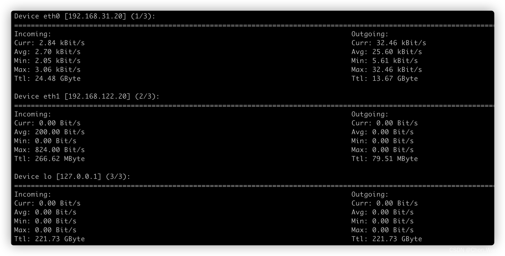
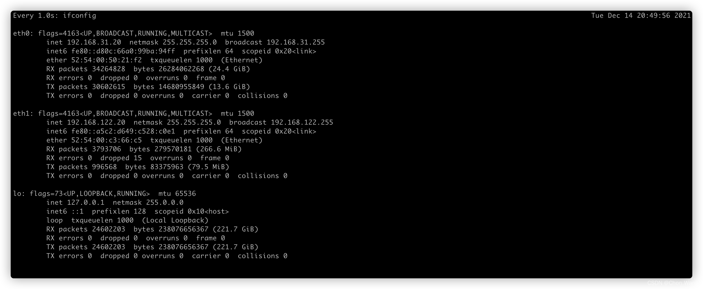

# Linux 简单查看网卡实时网速

操作系统： centos7
默认已安装以下所用工具，如果没安装，自行安装一下啦

## 1. nload 查看
```
# 查看所有网卡实时网速
sudo nload -m 

# 查看指定网卡实时网速
sudo nload eth0 -m
```

**查看所有网卡时，切换网卡**：左右方向键（按左右键显示 截图最上方 1/3、2/3、3/3 查看不同网卡速度）
**-m**： 只显示统计数据 (推荐)，不显示流量图
**退出查看： 按 q 键**



## 2. 通过 ifconfig 实时查看

```
watch -n 1 ifconfig
```

### ifconfig 实时查看效果

**RX: 接收流量**
**TX: 发送流量**
**计算方法：** (**KB** = 数值 / 1000) (**MB** = 数值 / 100000)
**退出查看： 按 ctrl+c 键**

