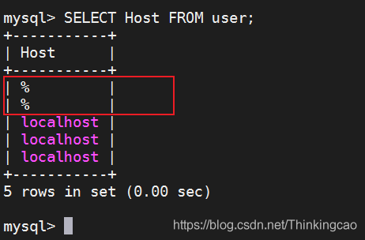
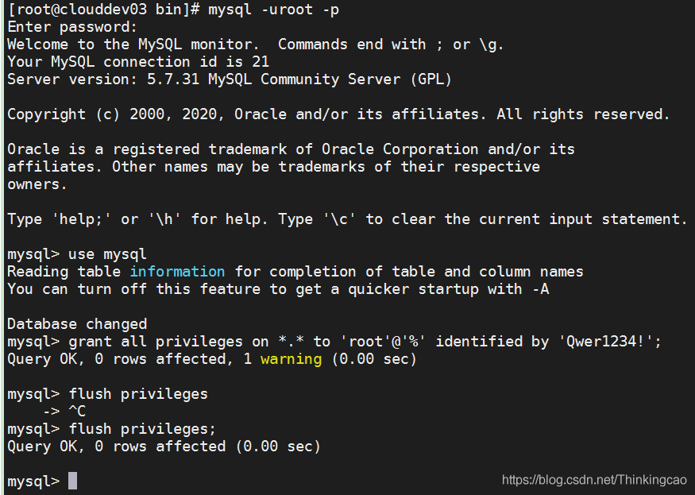

# Mysql 授权 root 账户允许远程连接访问

## 一. 前言

在 Linux 上安装完 Mysql 后，需要对 root 账户授权[远程连接](https://so.csdn.net/so/search?q=远程连接&spm=1001.2101.3001.7020)访问的权限，同时如果你创建了一个新的 Mysql 用户，同样也需要对该账户授权远程连接访问的权限；Mysql 授权允许远程登录后，linux 中安装的 Mysql 可以与 Navicat for Mysql（可视化）等连接，在可视化软件下管理数据库和创建数据库操作。

## 二. 授权允许远程访问

### 1. 终端登录 Mysql：

```
mysql -uroot -p 或者 mysql -uQwer1234! -proot
```

**解释：**

- -uroot： -u 后面表示账号， -pQwer1234!： -p 后面表示密码

### 2. 使用 mysql：

```
use mysql
```

### 3. 授权命令：

```
grant all privileges on *.* to 'root'@'%' identified by 'Qwer1234!';
```

其中 "*.*" 代表所有资源所有权限， “‘root’@%” 其中 root 代表账户名，% 代表所有的访问地址。IDENTIFIED BY ‘密码’，这里换成数据库 root 用户的密码，WITH GRANT OPTION 表示允许级联授权。

### 4. 刷新授权：

```
flush privileges; 
```

### 5. 查看授权是否成功：

```
select Host from user;
```




出现下方结果表示已经授权成功，此时可以远程登录了

## 三. 关闭授权

如果想要关闭授权，可执行以下命令：

```
revoke all on *.* from dba@localhost;
```

## 四. Mysql 相关命令

如果上述配置不生效，可尝试重启 mysql 服务，命令如下：

### 4.1 重启 Mysql

```
service mysqld restart  // 重启mysql服务
```

### 4.2 查看是否启动

```
service mysql status
```

## 五. 命令行截图

