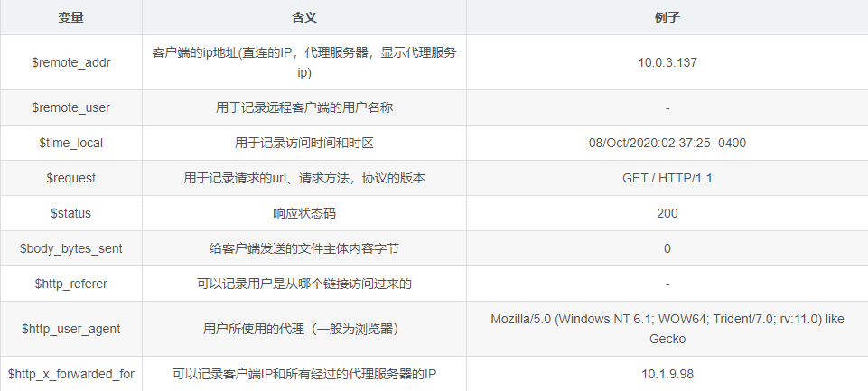
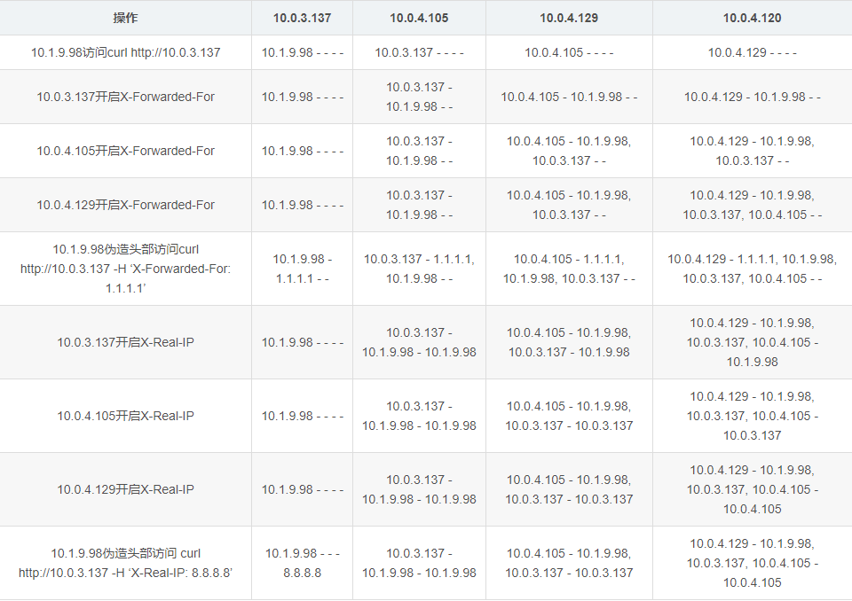

# Nginx 多级代理下获取客户端真实IP地址

> 多级代理中获取客户端真实IP

### 日志的格式

nginx中常用日志格式配置如下：

```
log_format  main  '$remote_addr - $remote_user [$time_local] "$request" '
                  '$status $body_bytes_sent "$http_referer" '
                  '"$http_user_agent" "$http_x_forwarded_for"';
access_log  /var/log/nginx/access.log  main;
```

其中的main为日志格式的别名，在使用的时候直接使用别名即可。

例子：

```
10.0.3.137 - - [09/Oct/2020:09:41:02 +0800] "GET / HTTP/1.0" 304 0 "-" "Mozilla/5.0 (Windows NT 6.1; WOW64; Trident/7.0; rv:11.0) like Gecko" "10.1.9.98"
```



日积月累下，日志文件会越来越大，日志文件太大严重影响服务器效率，所以需要定时对日志文件进行切割。

由于这里是演示，所以切割方式是按分钟来切割，正常生产上使用一般是按天来进行分割：

```
#!/bin/bash
#日志文件存放目录
LOGS_PATH=/usr/local/nginx/logs
#备份文件名称
YESTERDAY=$(date -d "yesterday" +%Y%m%d%H%M)
#重命名日志文件
mv ${LOGS_PATH}/access.log ${LOGS_PATH}/access_${YESTERDAY}.log
mv ${LOGS_PATH}/error.log ${LOGS_PATH}/error_${YESTERDAY}.log
## 向 Nginx 主进程发送 USR1 信号。USR1 信号是重新打开日志文件
kill -USR1 $(cat /usr/local/nginx/logs/nginx.pid)
```

然后添加定时任务：

```
# crontab -e
*/1 * * * * /bin/bash /usr/local/nginx/logs/nginx_log.sh
```

### 获取客户端真实IP

服务器资源分配情况如下：

- `10.1.9.98`：充当客户端
- `10.0.3.137`：一级代理
- `10.0.4.105`：二级代理
- `10.0.4.129`：三级代理
- `10.0.4.120`：服务器端，为了方便，这里使用一个nginx充当服务器端，正常情况下一般是一个web服务器，如tomcat。

**各个服务初始配置如下：**

10.0.3.137的配置：

```
worker_processes  1;

events {
    worker_connections  1024;
}

http {
    include       mime.types;
    default_type  application/octet-stream;

    log_format main '$remote_addr - $http_x_forwarded_for - $http_x_real_ip';

    access_log  logs/access.log  main;

    server {
        listen  80;

        location / {
                # proxy_set_header X-Real-IP $remote_addr;
                # proxy_set_header X-Forwarded-For $proxy_add_x_forwarded_for;
                proxy_pass http://10.0.4.105;
        }
    }

}
```

0.0.4.105的配置，其他配置与10.0.3.137的一致：

```
...
        location / {
                # proxy_set_header X-Real-IP $remote_addr;
                # proxy_set_header X-Forwarded-For $proxy_add_x_forwarded_for;
                proxy_pass http://10.0.4.129;
        }
...
```

10.0.4.129的配置，其他配置与10.0.3.137的一致：

```
...
        location / {
                # proxy_set_header X-Real-IP $remote_addr;
                # proxy_set_header X-Forwarded-For $proxy_add_x_forwarded_for;
                proxy_pass http://10.0.4.120;
        }
...
```

10.0.4.120的配置，其他配置与10.0.3.137的一致

```
...
        location / {
                root html;
                index index.html;
        }
...
```

下面的记录为access.log中打印的结果：



##### 总结：

- `X-Forwarded-For`是一个追加的过程，后面的代理会把前面代理的IP追加到`X-Forwarded-For`尾部，用逗号进行分隔。
- 应用服务器（10.0.4.120）无法从`X-Forwarded-For`中获取到与它直连的代理服务器的IP（10.0.4.129），此时我们可以使用远程ip（表示直连的那台代理），当服务器无法过`http_x_forwarded_for`获得上级代理或者客户端的ip时（可能没有经过代理），应该使用`$remote_addr`。
- 在代理过程中至少有一个代理设置了`X-Forwarded-For`，否则后面的代理或者应用服务器无法获得相关信息。
- `X-Forwarded-For`中虽然包含了真实的客户端IP，一般是第一个IP，但是如果客户端伪造了请求头，那么真实的客户端IP就不是第一个了。
- HTTP中header里面的X-Real-IP只是一个变量，后面的设置会覆盖前面的设置，所以只需要在第一个代理服务器上设置`proxy_set_header X-Real-IP $remote_addr`即可，然后在应用端直接引用`$http_x_real_ip`就行。

在java中，如果请求没有经过nginx代理，可以使用如下方法获取客户端的真实IP：

```
# 类似nginx中的$remote_addr
request.getRemoteHost();
```

如果请求经过了nginx代理，可以从请求头中获取（前提是必须正确配置nginx才能获取到）：

```
request.getHeader("x-real-ip");
```

如果是用的其他Apache，Squid等反向代理软件，同样是从请求头中获取真实IP，只是属性名不一样而已。