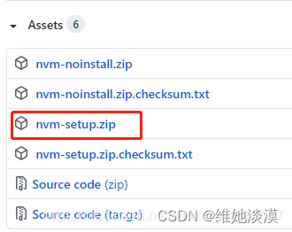
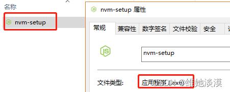
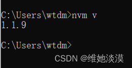
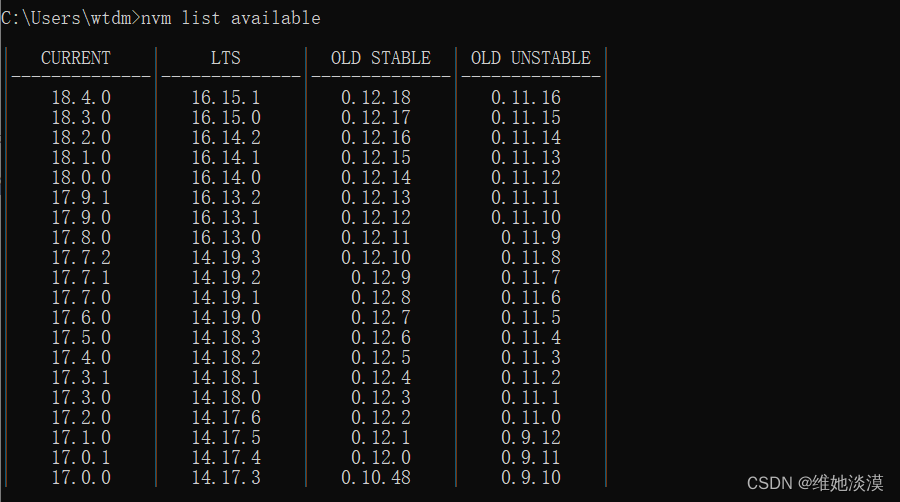

安装nvm管理工具（先关掉360等软件，不然会弹出警告！）

1.从官网下载安装包 https://github.com/coreybutler/nvm-windows/releases，下载红框里面的那个



2.将下载下来的压缩包进行解压（随便解压到任一你喜欢的位置），解压文件夹里面是一个.exe文件

 

3.开始进行nvm安装：
(1) 鼠标双击nvm-setup.exe文件，选择“我接受…”那一行，点击next

(2) 可以根据自身情况自定义选择路径盘，路径不要出现空格或中文符号（路径最好是在路径盘的根目录下，如C盘、D盘下的根目录），我自己选择D盘根目录。选好后点击next

(3) 选择node.js的安装位置，可以根据自身情况自定义选择路径盘，路径不要出现空格或中文符号（路径最好是在路径盘的根目录下新建一个文件夹，如C盘、D盘下的根目录），我自己在D盘根目录下新建一个nodejs文件夹。选好后点击next

(4) 最后一步，点击install即可安装完成 

3.1.nvm安装完成后，检验是否安装成功，进入命令控制行窗口（进入方法见前面），
输入命令nvm v查看，如果出现版本号，即安装成功（如果安装不成功，查看之前自己安装的node.js有没有删除彻底、安装nvm工过程有没有漏掉什么！）。



3.2.接下来就是安装node.js版本

(1) 输入命令行nvm list available查看可用的node.js版本号



(2) 输入命令行nvm install node版本号(例如：nvm install 12.17.0)即可安装对应版本以及自动安装对应的npm版本。除了上面显示的node.js版本，其他版本号也可以下载，只不过有些可以准确下载，有些会出现npm版本不会自动下载。 

安装完成后可以分别输入命令行node -v和npm -v，检验node.js以及对应npm是否安装成功，如果可以显示版本号这说明安装成功。

(3) 安装成功后，输入命令行nvm use node版本号（例如：nvm use 12.17.0）即可选择你本地所使用的Node.js版本，使用此命

令行可以根据你自己的需要随意切换node.js版本运行。

(4) 输入命令行nvm ls查看你安装的所有node.js版本号，以及你当前所选择的node.js运行版本

(5) 如果想删除某node.js版本的话，输入命令行nvm uninstall node版本号,即可删除对应版本

总结：使用nvm来管理node.js的版本真的很方便，这样就可以根据自己的需要来回切换node.js版本！


2.在nvm安装目录中打开settings.txt，添加下面两行代码：
```
node_mirror: https://npm.taobao.org/mirrors/node/
npm_mirror: https://npm.taobao.org/mirrors/npm/
```
3. 重新执行nvm install node版本号的命令下载