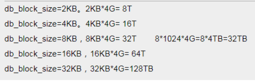

# oracle 表空间文件达到32G后解决办法

数据库报错："ORA-01654: 索引。。。无法通过8192（在表空间。。。中）扩展"、或者：ora-01652无法通过128(在表空间temp中)扩展temp段，这种错误信息时，表明数据库表空间文件或者临时表空间文件已经达到上限；

解决办法：增加表空间文件，sql语句如下： alter tablespace temp add tempfile '/oracle/database/oradata/orcl/temp02.dbf' size 10240m autoextend on next 1024m maxsize 30G;

常识一：
表空间数据文件容量与DB_BLOCK_SIZE有关，在初始建库时，DB_BLOCK_SIZE要根据实际需要，设置为 4K、8K、16K、32K、64K等几种大小，ORACLE的物理文件最大只允许4194304个数据块（由操作系统决定），表空间数据文件的最大值为 4194304×DB_BLOCK_SIZE/1024M。

sql查看DB_BLOCK_SIZE值：

select value/1024 as "kb" from v$parameter where name='db_block_size'

可以看到这个数据库DB_BLOCK_SIZE值为8k，所以单个表空间文件最大值为8K*2^22 = 32G，由此可推出：

2K = 8G、8K = 32G、16K = 64G、32K = 128G；

DB_BLOCK_SIZE作为数据库的最小操作单位，是在创建数据库的时候指定的，在创建完数据库之后便不可修改。要修改DB_BLOCK_SIZE，需要重建数据库。一般可以将数据EXP出来，然后重建数据库，指定新的DB_BLOCK_SIZE，然后再将数据IMP进数据库。
DB_BLOCK_SIZE一般设置为操作系统块的倍数，即2K,4K,8K,16K或32K，但它的大小一般受数据库用途的影响。对于联机事务，其特点是事务量大，但每个事务处理的数据量小，所以DB_BLOCK_SIZE设置小点就足够了，一般为4K或者8K，设置太大话一次读出的数据有部分是没用的，会拖慢数据库的读写时间，同时增加无必要的IO操作。而对于数据仓库和ERP方面的应用，每个事务处理的数据量很大，所以DB_BLOCK_SIZE一般设置得比较大，一般为8K，16K或者32K，此时如果DB_BLOCK_SIZE小的话，那么I/O自然就多，消耗太大。
大一点的DB_BLOCK_SIZE对索引的性能有一定的提高。因为DB_BLOCK_SIZE比较大的话，一个DB_BLOCK一次能够索引的行数就比较多。
对于行比较大的话，比如一个DB_BLOCK放不下一行，数据库在读取数据的时候就需要进行行链接，从而影响读取性能。此时DB_BLOCK_SIZE大一点的话就可以避免这种情况的发生
常识二、
如果单个数据库表空间文件大小超过要导入的数据库表空间最大大小，比如1T的数据库文件需要导入，解决办法：

创建bigfile大文件表空间：在oracle11g中引进了bigfile表空间，他充分利用了64位CPU的寻址能力，使oracle可以管理的数据文件总量达到8EB。单个数据文件的大小达到128TB，即使默认8K的db_block_size也达到了32TB。

所谓Bigfile Tablespace最显著的差别就是一个表空间只能对应一个数据文件。Bigfile Tablespace虽只对应一个数据文件，但数据文件对应的最大体积大大增加。传统的small datafile每个文件中最多包括4M个数据块，按照一个数据块8K的大小核算，最大文件大小为32G。每个Small Tablespace理论上能够包括1024个数据文件，这样计算理论的最大值为32TB大小。而Bigfile Datafile具有更强大的数据块block容纳能力，最多能够包括4G个数据块。同样按照数据块8K计算，Bigfile Datafile大小为32KG=32TB。理论上small tablespace和big tablespace总容量相同

bigfile tablespace 设置不同大小的db_block_size时数据文件的最大值：

需要注意的是：使用bigfile表空间，它只能支持一个数据文件。也就是说这个文件的最大大小就是表空间最大大小，你不可能通过增加数据文件来扩大该表空间的大小。

所以需要根据实际情况，在建数据库时指定db_block_size的大小，要不然建完数据库后无法修改