介绍如何将centos7的Python由2升级到3

## 工具/原料

- centos7
- Python-3.6.5.tgz

## 方法/步骤

1. 

   目前，centos7默认安装的是Python2.7

   执行python -V可以查看当前centos中安装的Python的版本

   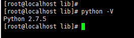

2. 

   下载Python3.x，进入官网下载

   如图，点击图示第一个，下载.tgz压缩文件

   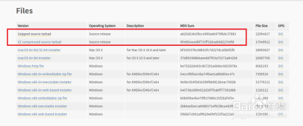

3. 

   执行 tar -zvxf Python-3.6.5.tgz解压安装包

   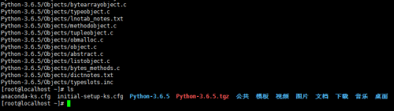

4. 

   进入解压后的文件夹：cd Python-3.6.5

   执行 ./configure

   检查系统是否有合适的编译器编译源代码及是否具备正确的依赖关系

   如图执行后报了错误信息，缺失GUN C编译器

   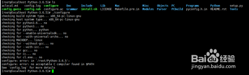

5. 

   执行yum install gcc安装

   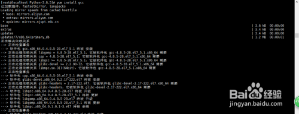

6. 

   安装完成之后，再次执行./configure，结果如图

   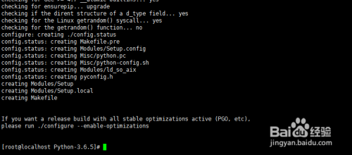

7. 

   执行make编译源码，执行过程中会有大量输出

   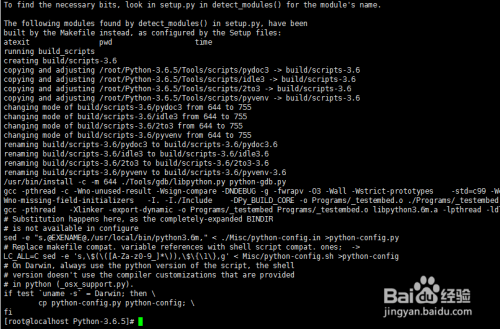

8. 

   执行make isntall 安装

   安装过程中报错zipimport.ZipImportError: can't decompress data; zlib not available

   解决办法：执行yum -y install zlib* 安装所需依赖

   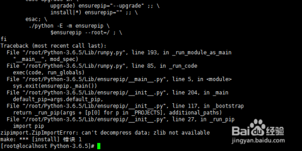

   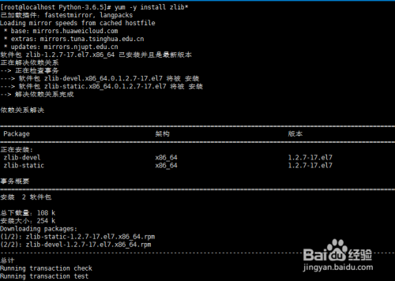

9. 

   再次执行make install，也会有大量输出，如图安装成功

   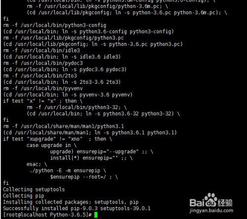

10. 

    备份原有配置，设置python默认版本号为3.x

    mv /usr/bin/python /usr/bin/python.bak

    再执行：

    ln -s /usr/local/bin/python3 /usr/bin/python

    最后，执行python -V验证，如图版本变成了3.x

    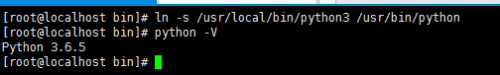