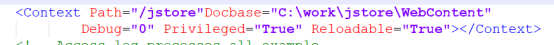
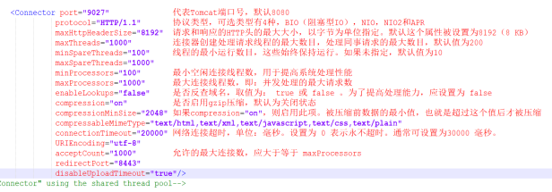
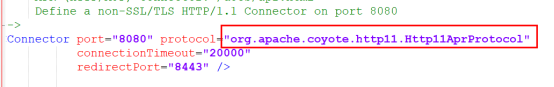
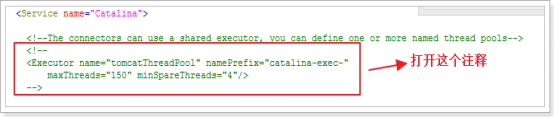
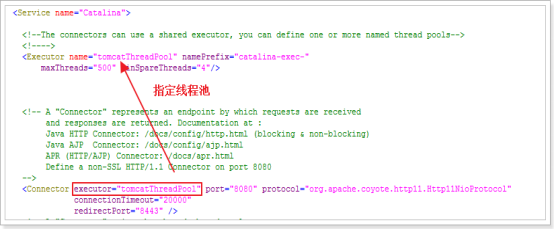
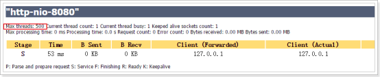
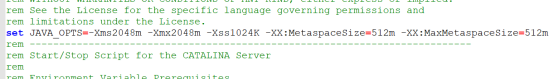
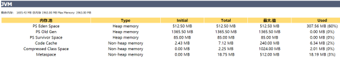

## 1. **tomcat三种部署方式**

第一种：直接将 web 项目文复制到tomcat的webapps目录中。

第二种：在本地tomcat的conf目录中，新建Catalina/localhost目录（这里要注意文件名的大小写），然后在该目录下新建一个xml文件，名字不可以随意取，要和path后 的名字一致，我这里就应该是jstore.xml文件，它的具体内容为：

<Context docBase="C:\work\jstore\web" path="/jstore" reloadable="true"/>

第三种: 在tomcat中的conf目录下的server.xml文件中，在<Host/>节点中添加一个context，具体为：

 

## 2. **tomcat配置与优化**

2.1. Connector连接器，主要负责Tomcat与客户端的通讯, 在/conf/server.xml文件中

Connector默认配置，如图

 

### Connector参数配置与优化说明

 

2.2. Protocol线程协议配置：

HTTP/1.1：默认值，使用的协议与Tomcat版本有关。在Tomcat9中，默认自动选取使用NIO或APR（如果找到APR需要的本地库，则使用APR，否则使用NIO）

org.apache.coyote.http11.Http11Protocol：BIO

org.apache.coyote.http11.Http11NioProtocol：NIO

org.apache.coyote.http11.Http11Nio2Protocol：NIO2

org.apache.coyote.http11.Http11AprProtocol：APR

大多数情况下性能比较，apr >nio>bio

配置方式，如图

 

2.3. Connector线程池配置：

 

 

 

 

 

**Executor的主要属性包括：**

name：该线程池的标记

maxThreads：线程池中最大活跃线程数，默认值200（Tomcat7和8都是）

minSpareThreads：线程池中保持的最小线程数，最小值是25

maxIdleTime：线程空闲的最大时间，当空闲超过该值时关闭线程（除非线程数小于minSpareThreads），单位是ms，默认值60000（1分钟）

daemon：是否后台线程，默认值true

threadPriority：线程优先级，默认值5

namePrefix：线程名字的前缀，线程池中线程名字为：namePrefix+线程编号

2.4. jvm参数配置 

Windows:

修改文件：bin/catalina.bat，设置参数（写在第一行）

set JAVA_OPTS=-Xms2048m -Xmx2048m -Xss1024K -XX:MetaspaceSize=512m -XX:MaxMetaspaceSize=512m

 

查看Server Status

 

**Linux：**

修改bin/catalina.sh文件参数（写在第一行）

JAVA_OPTS=-Xms2048m -Xmx2048m -Xss1024K -XX:MetaspaceSize=512m

-XX:MaxMetaspaceSize=512m

参数说明：

1、 file.encoding 默认文件编码

2、 -Xmx1024m  设置JVM最大可用内存为1024MB

3、 -Xms1024m  设置JVM最小内存为1024m

4、 -XX:NewSize  设置年轻代大小

5、 XX:MaxNewSize 设置最大的年轻代大小

6、 -XX:PermSize  设置永久代大小

7、 -XX:MaxPermSize 设置最大永久代大小

8、 -XX:NewRatio=4:设置年轻代（包括Eden和两个Survivor区）与终身代的比值（除去永久代）。设置为4，则年轻代与终身代所占比值为1：4，年轻代占整个堆栈的1/5

9、 -XX:+DisableExplicitGC这个将会忽略手动调用GC的代码使得 System.gc()的调用就会变成一个空调用，完全不会触发任何GC