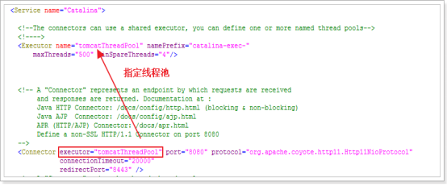
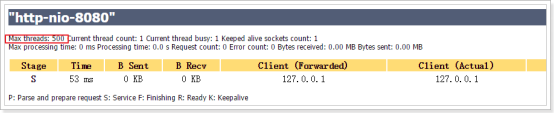
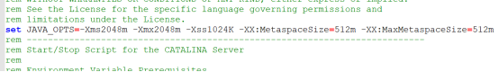

设置系统属性

```shell
-Djavax.servlet.request.encoding=UTF-8
-Djavax.servlet.response.encoding=UTF-8 
-Dfile.encoding=UTF-8 
-Duser.country=CN 
-Duser.language=zh
```


## 1. **tomcat三种部署方式**

第一种：直接将 web 项目文复制到tomcat的webapps目录中。

第二种：在本地tomcat的conf目录中，新建Catalina/localhost目录（这里要注意文件名的大小写），然后在该目录下新建一个xml文件，名字不可以随意取，要和path后 的名字一致，我这里就应该是jstore.xml文件，它的具体内容为：

<Context docBase="C:\work\jstore\web" path="/jstore" reloadable="true"/>

第三种: 在tomcat中的conf目录下的server.xml文件中，在<Host/>节点中添加一个context，具体为：

 

## 2. **tomcat配置与优化**

2.1. Connector连接器，主要负责Tomcat与客户端的通讯, 在/conf/server.xml文件中

Connector默认配置，如图

 

### Connector参数配置与优化说明

 

```xml
	<Connector port="8080"
               protocol="HTTP/1.1"
               maxHttpHeaderSize="8192"
               maxThreads="1000"
               minSpareThreads="100"
               maxSpareThreads="1000"
               enableLookups="false"
               compression="on"
				compressionMinSize="2048"               			             compressibleMimeType="text/html,text/xml,text/plain,text/css,text/javascript,application/javascript"
               connectionTimeout="20000"
               URIEncoding="UTF-8"
               acceptCount="1500"
               disableUploadTimeout="true"
               redirectPort="8443" />
```

2.2. Protocol线程协议配置：

HTTP/1.1：默认值，使用的协议与Tomcat版本有关。在Tomcat9中，默认自动选取使用NIO或APR（如果找到APR需要的本地库，则使用APR，否则使用NIO）

org.apache.coyote.http11.Http11Protocol：BIO

org.apache.coyote.http11.Http11NioProtocol：NIO

org.apache.coyote.http11.Http11Nio2Protocol：NIO2

org.apache.coyote.http11.Http11AprProtocol：APR

大多数情况下性能比较，apr >nio>bio

配置方式，如图

 

2.3. Connector线程池配置：

 

 

 

 

 

**Executor的主要属性包括：**

name：该线程池的标记

maxThreads：线程池中最大活跃线程数，默认值200（Tomcat7和8都是）

minSpareThreads：线程池中保持的最小线程数，最小值是25

maxIdleTime：线程空闲的最大时间，当空闲超过该值时关闭线程（除非线程数小于minSpareThreads），单位是ms，默认值60000（1分钟）

daemon：是否后台线程，默认值true

threadPriority：线程优先级，默认值5

namePrefix：线程名字的前缀，线程池中线程名字为：namePrefix+线程编号

2.4. jvm参数配置 

Windows:

修改文件：bin/catalina.bat，设置参数（写在第一行）

set JAVA_OPTS=-Xms2048m -Xmx2048m -Xss1024K -XX:MetaspaceSize=512m -XX:MaxMetaspaceSize=512m

 

查看Server Status

 

**Linux：**

修改bin/catalina.sh文件参数（写在第一行）

JAVA_OPTS=-Xms2048m -Xmx2048m -Xss1024K -XX:MetaspaceSize=512m

-XX:MaxMetaspaceSize=512m

参数说明：

1、 file.encoding 默认文件编码

2、 -Xmx1024m  设置JVM最大可用内存为1024MB

3、 -Xms1024m  设置JVM最小内存为1024m

4、 -XX:NewSize  设置年轻代大小

5、 XX:MaxNewSize 设置最大的年轻代大小

6、 -XX:PermSize  设置永久代大小

7、 -XX:MaxPermSize 设置最大永久代大小

8、 -XX:NewRatio=4:设置年轻代（包括Eden和两个Survivor区）与终身代的比值（除去永久代）。设置为4，则年轻代与终身代所占比值为1：4，年轻代占整个堆栈的1/5

9、 -XX:+DisableExplicitGC这个将会忽略手动调用GC的代码使得 System.gc()的调用就会变成一个空调用，完全不会触发任何GC

2.5. Tomcat中web.xml配置

应用程序运行时最终会加载conf/web.xml和应用的web.xml的合集

每一个web应用最终是被发布到Tomcat的webappes目录下，Tomcat是它们的运行环境。可以理解为Tomcat的web.xml文件是每一个web应用的web.xml的父文件，Tomcat将每个应用的公共配置提取出来放在conf目录下的web.xml中，每个应用的个性配置放在自己的web.xml文件

1.指定欢迎页面，在应用的web.xml中如果没有对<welcome-file-list>进行覆盖，那么默认主页为index.html、index.html、index.jsp。

 

2.设置session的存活时间，默认为30分钟

 

3. 设置过滤器，过滤所有资源

 

4.定义了WEB应用的名字

 

5. 返回特定HTTP状态代码时，或者特定类型的异常被抛出时，能够制定将要显示的页面

 

6.配置servlet初始化参数

 

servlet 配置Servlet

servlet-name 定义Servlet的名字

servlet-class 指定实现这个servlet的类

init-param 定义Servlet的初始化参数和参数值，可有多个init-param

load-on-startup 指定当Web应用启动时，装载Servlet的次序，当值为正数或零时，Servlet容器先加载数值小的servlet，再依次加载其他数值大的servlet

 

 

4.6. Logs目录默认日志文件

tomcat 有五类日志 ：catalina、localhost、manager、admin、host-manager

1.catalina.out

即标准输出和标准出错，所有输出到这两个位置的都会进入catalina.out，这里包含tomcat运行自己输出的日志以及应用里向console输出的日志。默认这个日志文件是不会进行自动切割的，我们需要借助其他工具进行切割（注意：catalina.out文件如果过大会影响）

2. catalina.{yyyy-MM-dd}.log

这个主要是记录tomcat启动时候的信息，类似于我们在eclipse中启动服务的时候在控制台看到的信息。在里面可以看到启动的JVM参数以及操作系统等日志信息。如果没有使用log4j等日志机制，系统的的错误信息与打印语句也在这个日志文件中记录。(linux下所有的日志都在catalina.out中)

3.host-manager.日期.log

放tomcat的自带的manager项目的日志信息的

4. localhost.{yyyy-MM-dd}.log

主要是应用初始化(listener, filter, servlet)未处理的异常最后被tomcat捕获而输出的日志,它也是包含tomcat的启动和暂停时的运行日志,但它没有catalina.2018-09-19.log 日志全。它只是记录了部分日志

5.localhost_access_log.日期.txt

是存放访问tomcat的请求的所有地址以及请求的路径、时间，请求协议以及返回码等信息(重要)

6.manager.YYYY-MM-DD.log

是tomcat manager项目专有的日志文件