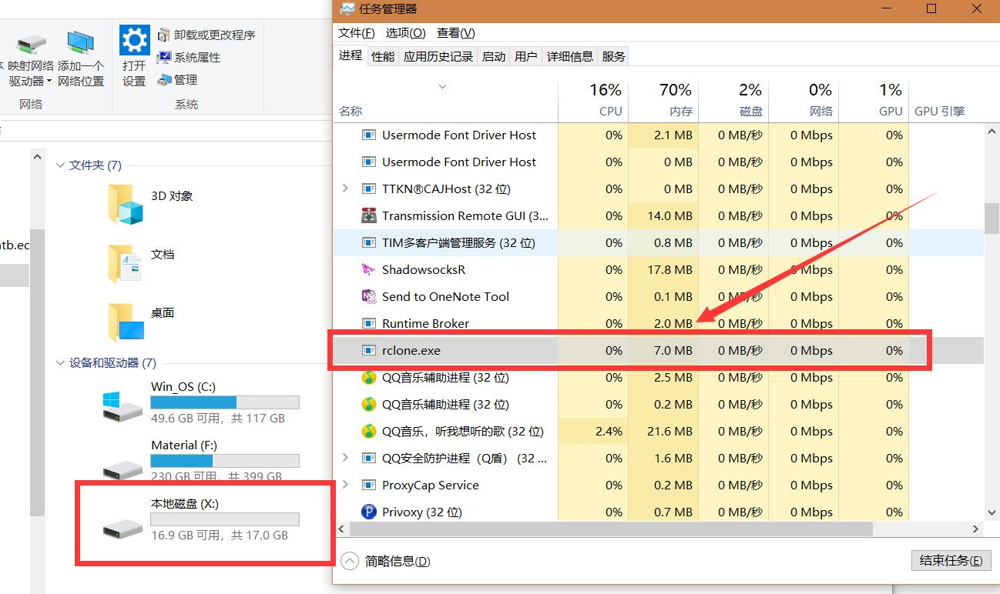
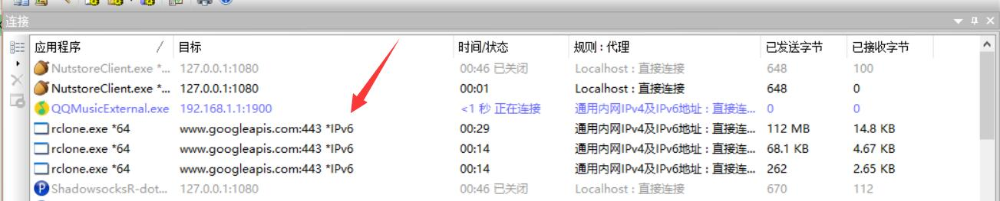
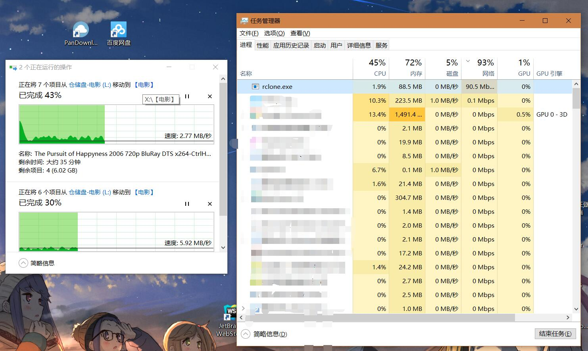
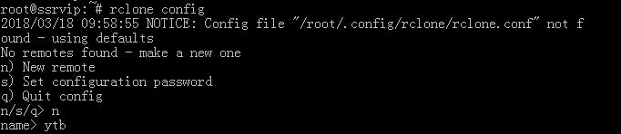
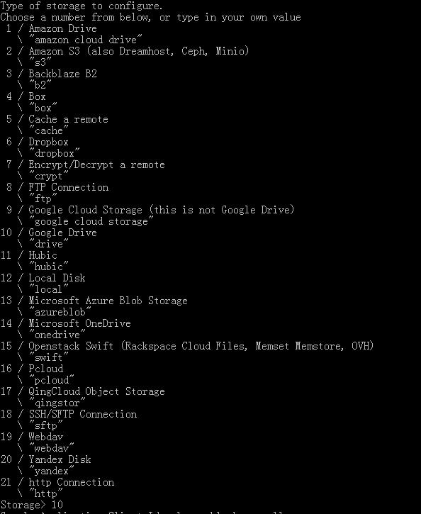

# 使用rclone在Windows下挂载Google个人/团队云盘

** Rhilip ** 2018-05-01 AM ** 36314℃ ** 22条

前几天上了朋友提供的Google云盘商业版的车
但是Google默认提供的工具 `Backup and Sync` 中并不能对团队云盘进行编辑，而 `Drive File Stream` 又提示不是 G Suite账号不能使用（额，虽然我个人觉得应该是管理员没有开相关权限。。。。。。
结果试了下rclone可以在Windows环境下挂载，那tm的就`rclone大法好，rclone大法好，rclone大法好`了喽。。。

> 本处仅讲mount操作，但其他rclone命令也可在windows环境下使用。

# 工具

- rclone ： https://rclone.org/downloads/
- winfsp ： http://www.secfs.net/winfsp/download/

其中rclone的windows版需要解压，并添加解压目录到系统路径中。（额，不添加，然后使用时写完整路径也行23333）。而依赖库winfsp下载完后一路Next直接安装就可以了。

> 补充工具

- mmozeiko/RcloneBrowser： https://github.com/mmozeiko/RcloneBrowser 一款跨平台的Rclone GUI，鉴于此Repo已经很久没有更新。请考虑使用该fork： https://github.com/kapitainsky/RcloneBrowser/releases

# 添加Google团队云盘

确认rclone已经添加到系统路径中后可以使用`rclone config`进入配置项。
具体的配置设置可参见下面他人写的帮助或者直接搜索就行，挺简单的所以本处不再累述（实际情况是没有对中间过程做保存），注意在提示“Configure this as a team drive?”时，输入`Y`，并填入需要使用的团队云盘。

- Linux下的Rclone简单教程(支持VPS数据同步,多种网盘,支持挂载) | 半醉的博客：https://ymgblog.com/2018/03/09/296/
- 官方文档： https://rclone.org/drive/#team-drives

# 挂载 Mount

我这里假设我前面添加的名称为`GDrive`，想要挂载在本机的`X:`上，并设置缓存目录为`F:\Temp`（cache路径中请不要带有空格，默认缓存目录为C盘用户目录下， `C:\Users\<Your user name>\AppData\Local\rclone`）。那么运行以下命令执行挂载（整个GDrive根目录）操作，然后你就会看到一个可爱的X盘出现了~

```
rclone mount GDrive:/ x: --cache-dir F:\Temp --vfs-cache-mode writes
```

关于`vfs-cache-mode`项设置，还是建议看下官方的说明根据自己的需求和网络情况来进行选择 https://rclone.org/commands/rclone_mount/#file-caching 。这里只做简单说明：

- `off`： In this mode the cache will read directly from the remote and write directly to the remote without caching anything on disk. （本地不做任何缓存，所有文件直接从云端获取并写入。**建议网速特别好时（复制粘贴大文件时建议至少100M管以上速度）使用。**
- `minimal`： This is very similar to “off” except that files opened for read AND write will be buffered to disks. This means that files opened for write will be a lot more compatible, but uses the minimal disk space. （和off类似，但是已经打开的文件会被缓存到本地。**个人推荐，小文件基本够用，但是如果你的网络情况（梯子）不是特别好的话，用writes也行**
- `writes`： In this mode files opened for read only are still read directly from the remote, write only and read/write files are buffered to disk first. （如果文件属性为`只读`则只从云端获取，不然先缓存在本地进行读写操作，随后被同步。**个人推荐使用，但是在直接从本地复制文件到GDrive时还是看网络情况**
- `full`：In this mode all reads and writes are buffered to and from disk. When a file is opened for read it will be downloaded in its entirety first. （所有的读写操作都会缓存到磁盘中。然后才会同步。**不是很推荐。会导致所有文件均被缓存到本地。直到达到你缓存总额（--cache-total-chunk-size，默认大小10G）。但是你网速特别差时也可以使用。**

# 后端运行以及开机自动挂载

上面的挂载操作在退出cmd后就自动结束了，所以我们需要让它后台运行。
rclone虽然提供了`--daemon`参数来实行后台运行，但是该参数并不适合于windows环境中。会有如下提示：

```
λ rclone mount GDrive:/ x: --cache-dir F:\Temp --vfs-cache-mode writes --daemon
2018/05/01 09:54:19 background mode not supported on windows platform
```

所以，我们需要另外想个办法让rclone能够后端运行以及开机自动挂载。

在你之前解压的rclone目录下新建一个文本文件，填入以下内容，**请注意修改倒数第二行的`WS.Run`中相关命令为你上步成功执行的命令**，然后将该文件名改为`rclone.vbs` （后缀名为`.vbs`即可）

```
Option Explicit
Dim WMIService, Process, Processes, Flag, WS
Set WMIService = GetObject("winmgmts:{impersonationlevel=impersonate}!\\.\root\cimv2")
Set Processes = WMIService.ExecQuery("select * from win32_process")
Flag = true
for each Process in Processes
    if strcomp(Process.name, "rclone.exe") = 0 then
        Flag = false
        exit for
    end if
next
Set WMIService = nothing
if Flag then
    Set WS = Wscript.CreateObject("Wscript.Shell")
    WS.Run "rclone mount GDrive:/ x: --cache-dir F:\Temp --vfs-cache-mode writes", 0
end if
```

完成后双击运行，你会看到X盘挂载成功。

> 补充说明下，如果你看到显示的挂载空间其实是个人空间大小，请参阅此issue: [The amount of disk space incorrent when mount Team Drives (gdrive) in Windows 10 · Issue #2288 · ncw/rclone](https://github.com/ncw/rclone/issues/2288) 下载最新的rclone并安装。但超大文件仍建议使用`rclone copy`或者`rclone sync`进行复制或者同步操作，而不是直接使用挂载盘，以免卡挂载盘。



如果你需要中断这个挂载操作，请直接在任务管理器中kill掉`rclone.exe`进程即可。

然后将这个文件复制（或者剪贴）到开机项中`C:\ProgramData\Microsoft\Windows\Start Menu\Programs\StartUp`（Windows 10）即可实现开机自动挂载~

# 上传速度相关

rclone直接连通`www.goolgeapis.com`进行文件的上传与下载操作。能直接走IPv6流量，在教育网100M环境下，能做到满速上传。其他环境网速视你的网络情况决定。






# 开机自动后台运行

由于在 Windows 下 RClone 不支持`--deamon`参数，故使用 NSSM 来实现

> **NSSM - the Non-Sucking Service Manager**

**
**某种程度上和 NMSL 差不多嘛

同样使用 scoop 安装

**scoop install nssm**

使用 NSSM 配置 Windows 服务

**nssm install [customname]**

在弹出 GUI 中配置：

1. Path：选择 rclone 的路径。使用 scoop 安装的程序路径为 C:\Users[username]\scoop\rclone\current\rclone.exe
2. Argument：参数。即挂载测试中之后rclone的那一串。由于 NSSM 默认使用系统管理员账号执行命令，配置文件与当前用户不一定一致，所以需要在参数中指定配置文件路径。还可以加上`--volname`为挂载盘指定名称
   mount unraid:/mnt/user P: --volname UNRAID --config C:\Users[username].config\rclone\rclone.conf

完成后在 Windows 任务管理器的服务选项卡中，找到刚刚创建的服务，右键开始即可。

轻量，无感，纯命令行安装和配置挂载。nice


# Rclone-超好用的挂载各家网盘与VPS 桥梁的工具

- 
- [ 发表评论](https://www.vjsun.com/59.html#respond)
-  14,683
- 

- A+

所属分类：[TOOL](https://www.vjsun.com/category/tool/)

[Rclone](http://www.vjsun.com/wp-content/themes/begin/inc/go.php?url=https://www.aiaj.net/tag/rclone/) 是一款的命令行工具，支持在不同对象存储、网盘间同步、上传、下载数据。

搭建环境：本人基本都是采用的军哥的LNMP作为网站的环境，这里不在阐述如何搭建，网站内可以找到。

Rclone安装命令：

> wget https://downloads.rclone.org/rclone-current-linux-amd64.zip
>
> unzip rclone-current-linux-amd64.zip
>
> chmod 0777 ./rclone-*/rclone
>
> cp ./rclone-*/rclone /usr/bin/
>
> rm -rf ./rclone-*
>
> ------
>
> rclone config

[](https://www.vrrmr.net/img/random/2018/05/rclone1.jpg)NAME：这里个人随便设置，我自己写的YTB

[](https://www.vrrmr.net/img/random/2018/05/rclone2.jpg)

可以看到每个数字代表了不同的网盘，我选者的是10：google drive

之后的 client id client secret 都不填，直接回车

use auto config 选择 n 然后会得到一个链接

这个链接复制到浏览器，登录自己的GG账号点同意，给出一段密码，将其复制到终端中，回车 然后输入 n y q。结束

> ```shell
> n) New remote
> s) Set configuration password
> q) Quit config
> n/s/q> n
> name> aria2down  #随便填，后面要用到
> Type of storage to configure.
> Choose a number from below, or type in your own value
>  1 / Alias for a existing remote
>    \ "alias"
>  2 / Amazon Drive
>    \ "amazon cloud drive"
>  3 / Amazon S3 (also Dreamhost, Ceph, Minio, IBM COS)
>    \ "s3"
>  4 / Backblaze B2
>    \ "b2"
>  5 / Box
>    \ "box"
>  6 / Cache a remote
>    \ "cache"
>  7 / Dropbox
>    \ "dropbox"
>  8 / Encrypt/Decrypt a remote
>    \ "crypt"
>  9 / FTP Connection
>    \ "ftp"
> 10 / Google Cloud Storage (this is not Google Drive)
>    \ "google cloud storage"
> 11 / Google Drive
>    \ "drive"
> 12 / Hubic
>    \ "hubic"
> 13 / Local Disk
>    \ "local"
> 14 / Microsoft Azure Blob Storage
>    \ "azureblob"
> 15 / Microsoft OneDrive
>    \ "onedrive"
> 16 / Openstack Swift (Rackspace Cloud Files, Memset Memstore, OVH)
>    \ "swift"
> 17 / Pcloud
>    \ "pcloud"
> 18 / QingCloud Object Storage
>    \ "qingstor"
> 19 / SSH/SFTP Connection
>    \ "sftp"
> 20 / Webdav
>    \ "webdav"
> 21 / Yandex Disk
>    \ "yandex"
> 22 / http Connection
>    \ "http"
> Storage> 11 #选择11
> Google Application Client Id - leave blank normally.
> client_id> #留空(解决卡顿内存高的问题，可以添加自己网盘的id)
> Google Application Client Secret - leave blank normally.
> client_secret> #留空（解决卡顿内存高的问题，可以添加自己网盘的密钥
> Scope that rclone should use when requesting access from drive.
> Choose a number from below, or type in your own value
>  1 / Full access all files, excluding Application Data Folder.
>    \ "drive"
>  2 / Read-only access to file metadata and file contents.
>    \ "drive.readonly"
>    / Access to files created by rclone only.
>  3 | These are visible in the drive website.
>    | File authorization is revoked when the user deauthorizes the app.
>    \ "drive.file"
>    / Allows read and write access to the Application Data folder.
>  4 | This is not visible in the drive website.
>    \ "drive.appfolder"
>    / Allows read-only access to file metadata but
>  5 | does not allow any access to read or download file content.
>    \ "drive.metadata.readonly"
> scope> 1 #选择1
> ID of the root folder - leave blank normally.  Fill in to access "Computers" folders. (see docs).
> root_folder_id> #留空
> Service Account Credentials JSON file path  - leave blank normally.
> Needed only if you want use SA instead of interactive login.
> service_account_file> #留空
> Remote config
> Use auto config?
>  * Say Y if not sure
>  * Say N if you are working on a remote or headless machine or Y didn't work
> y) Yes
> n) No
> y/n> n  #选择n
> If your browser doesn't open automatically go to the following link: https://accounts.google.com/o/oauth2/auth....  #复制到浏览器打开，获取验证码
> Log in and authorize rclone for access
> Enter verification code>  #填入上面获取到的验证码
> Configure this as a team drive?
> y) Yes
> n) No
> y/n> y  #选择y
> Fetching team drive list...
> No team drives found in your account--------------------
> [Rats]
> client_id = 
> client_secret = 
> service_account_file = 
> token = {"access_token":"ya29.GltFBd7UJN2qrxdG8FnG_rMuB18ogb8QlujdL7glvXtfV"}
> team_drive = 
> --------------------
> y) Yes this is OK
> e) Edit this remote
> d) Delete this remote
> y/e/d> y  #选择y
> Current remotes:
> 
> Name                 Type
> ====                 ====
> aria2down            drive
> 
> e) Edit existing remote
> n) New remote
> d) Delete remote
> r) Rename remote
> c) Copy remote
> s) Set configuration password
> q) Quit config
> e/n/d/r/c/s/q> q  #选择q退出
> ```

如果你要挂载的文件夹不存在，请先创建文件夹，例如我要创建在 /home/wwwroot/域名/Gdrive

```
 mkdir -p /home/wwwroot/域名/Gdrive
 rclone mount ytb: /home/wwwroot/域名/Gdrive --allow-other &
```

## 2

> ```
> #新建本地文件夹，路径自己定，即下面的LocalFolder
>  mkdir -p /home/wwwroot/域名/Gdrive
> #挂载为磁盘
> rclone mount DriveName:Folder LocalFolder --copy-links --no-gzip-encoding --no-check-certificate --allow-other --allow-non-empty --umask 000
> ```

## `DriveName`为初始化配置填的`name`，`Folder`为`Google Drive`里的文件夹，`LocalFolder`为`VPS`上的本地文件夹。

挂载另外的一些命令说明方案：英文官方 [地址](http://www.vjsun.com/wp-content/themes/begin/inc/go.php?url=https://tip.rclone.org/commands/rclone_mount/#chunked-reading)

## 解决上传失败和内存占用高等问题

\#该参数主要是上传用的
/usr/bin/rclone mount DriveName:Folder LocalFolder \
--umask 0000 \
--default-permissions \
--allow-non-empty \
--allow-other \
--transfers 4 \
--buffer-size 32M \
--low-level-retries 200

\#如果你还涉及到读取使用，比如使用H5ai等在线播放，就还建议加3个参数，添加格式参考上面
--dir-cache-time 12h
--vfs-read-chunk-size 32M
--vfs-read-chunk-size-limit 1G

主要参数这里大概说下，具体自己根据vps配置进行调整。

--transfers：该参数控制最大同时传输任务数量，如果你cpu性能差，建议调低，但太低可能会影响多个文件同时传输的速度。
--buffer-size：该参数为读取每个文件时的内存缓冲区大小，控制rclone上传和挂载的时候的内存占用，调低点可以防止内存占用过高而崩溃，但太低可能会影响部分文件的传输速度。
--low-level-retries：该参数为传输文件没速度的时候重试次数，没速度的时候，单个会自动睡眠10ms起，然后再重试，不行，再睡眠更长一段时间，再重试，这样可以稍微加快文件上传进度

更加详细的介绍可以打开上边的官方地址看说明设置

## rclone 命令:

> rclone config - 以控制会话的形式添加rclone的配置，配置保存在.rclone.conf文件中。
> rclone copy - 将文件从源复制到目的地址，跳过已复制完成的。
> rclone sync - 将源数据同步到目的地址，只更新目的地址的数据。
> rclone move - 将源数据移动到目的地址。
> rclone delete - 删除指定路径下的文件内容。
> rclone purge - 清空指定路径下所有文件数据。
> rclone mkdir - 创建一个新目录。
> rclone rmdir - 删除空目录。
> rclone check - 检查源和目的地址数据是否匹配。
> rclone ls - 列出指定路径下所有的文件以及文件大小和路径。
> rclone lsd - 列出指定路径下所有的目录/容器/桶。
> rclone lsl - 列出指定路径下所有文件以及修改时间、文件大小和路径。
> rclone md5sum - 为指定路径下的所有文件产生一个md5sum文件。
> rclone sha1sum - 为指定路径下的所有文件产生一个sha1sum文件。
> rclone size - 获取指定路径下，文件内容的总大小。.
> rclone version - 查看当前版本。
> rclone cleanup - 清空remote。
> rclone dedupe - 交互式查找重复文件，进行删除/重命名操作。
>
> \### 文件上传
> rclone copy /home/backup gdrive:backup (我自己设置的是：（GD:SFVIDEO)# 本地路径 配置名字:谷歌文件夹名字
> \### 文件下载
> rclone copy gdrive:backup /home/backup
> \### 列表
> rclone ls gdrive:backup
> rclone lsl gdrive:backup # 比上面多一个显示上传时间
> rclone lsd gdrive:backup # 只显示文件夹
> \### 新建文件夹
> rclone mkdir gdrive:backup
> \### 挂载
> rclone mount gdrive:mm /root/mm &
> \### 卸载
> fusermount -u /root/mm

rclone配置文件存储位置 ~/.config/rclone/rclone.conf

其他的问题可以在GooGle上找寻，这里先到这把，另外在使用命令的时候最好先用一些不重要的文件做实验，以免造成不必要的损失。

### **自动启动：**

> wget https://www.vrrmr.net/Code/rcloned && vim rcloned

修改文件：

```
NAME=""  #rclone name名，及配置时输入的Name
REMOTE=''  #远程文件夹，Google Drive网盘里的挂载的一个文件夹
LOCAL=''  #挂载地址，VPS本地挂载目录
```

**设置自启**：

> ```
> mv rcloned /etc/init.d/rcloned
> chmod +x /etc/init.d/rcloned
> update-rc.d -f rcloned defaults
> bash /etc/init.d/rcloned start
> ```

\----------------------------------

添加一个一键安装代码：

```
wget https://www.vrrmr.net/Code/rclone_install.sh && bash  rclone_install.sh
rclone config #配置就按上边的就可以了
```